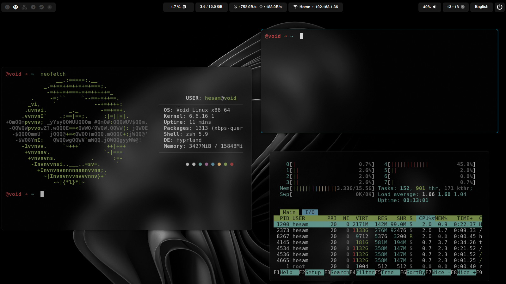

# Hyprland Configuration and Setup Guide for Void Linux



## Overview

This repository contains instructions and configurations for setting up Hyprland on Void Linux. Hyprland is a powerful Tiling compositor.

## Table of Contents

- [Hyprland Configuration and Setup Guide for Void Linux](#hyprland-configuration-and-setup-guide-for-void-linux)
  - [Overview](#overview)
  - [Table of Contents](#table-of-contents)
  - [Requirements](#requirements)
    - [Package Dependencies](#package-dependencies)
  - [Installation](#installation)
  - [Keybindings](#keybindings)
    - [Hyprland](#hyprland)
    - [Rofi](#rofi)
    - [Apps](#apps)

## Requirements

Ensure that your system meets the following requirements before proceeding:

### Package Dependencies

The following packages are required for the proper functioning of Hyprland on Void Linux:

<details>
  <summary><strong>Core Hyprland Components</strong></summary>

  - [Void-Hyprland](https://github.com/Makrennel/hyprland-void)
  - hyprland
  - hyprland-protocols
  - xdg-desktop-portal-hyprland
  - xdg-desktop-portal
</details>

<details>
  <summary><strong>System Components</strong></summary>

  - dbus : service
  - seatd : service
  - elogind : service
  - polkit : service
  - NetworkManager : service
  - base-devel
  - gnome-keyring
  - polkit-gnome
  - [ly](https://github.com/fairyglade/ly) : service
  - mesa-dri
  - qt5
  - qt5-wayland
  - qt6-wayland
  - [pipewire](https://docs.voidlinux.org/config/media/pipewire.html)
  - wireplumber
  - stow
  - inotify-tools
  - [rust](https://www.rust-lang.org/learn/get-started)
</details>

<details>
  <summary><strong>User Interface Components</strong></summary>

  - Waybar
  - swaybg
  - playerctl
  - [swww](https://github.com/LGFae/swww) : path /usr/local/bin
  - swaylock or [swaylock-effects](https://github.com/mortie/swaylock-effects)
  - grim
  - slurp
  - jq
  - cliphist
  - wl-clipboard
  - libnotify
  - dunst
  - swayidle
  - swappy
  - rofi
  - wlogout
  - font-awesome-6
  - fontmanager
  - gnome-system-monitor
</details>

## Installation

Follow these steps to install Hyprland on your Void Linux system:

1. Clone this repository:

   ```bash
   git clone https://github.com/hesam-init/.dotfiles.git ~/.dots-hyprland
   ```

2. Change into the repository directory:

   ```bash
   cd ~/.dots-hyprland
   ```

3. Run this command to sync hyprland configs:

   ```bash
   stow hyprland
   ```

## Keybindings

### Hyprland

|                                  Keys | Action                          |
| ------------------------------------: | :------------------------------ |
|                  <kbd>SUPER + C</kbd> | Close window                    |
|                  <kbd>SUPER + K</kbd> | Toggle Waybar                   |
|                  <kbd>SUPER + P</kbd> | Toggle pseudo-tiling            |
|                  <kbd>SUPER + D</kbd> | Toggle split                    |
|                        <kbd>F11</kbd> | Fullscreen                      |
|                  <kbd>SUPER + F</kbd> | Maximize                        |
|  <kbd>SUPER + Arrows or H,J,K,L</kbd> | Move window focus               |
|       <kbd>SUPER + ALT + Arrows</kbd> | Move tiled window               |
|       <kbd>SUPER + ALT + Arrows</kbd> | Resize window                   |
|           <kbd>SUPER + [1-9][0]</kbd> | Change workspace [1-10]         |
|   <kbd>SUPER + SHIFT + [1-9][0]</kbd> | Move window to workspace [1-10] |
|  <kbd>CTRL + SUPER + ARROW LEFT</kbd> | Go to previous workspace        |
| <kbd>CTRL + SUPER + ARROW RIGHT</kbd> | Go to next workspace            |
|         <kbd>SUPER + Left Click</kbd> | Drag window                     |
|        <kbd>SUPER + Right Click</kbd> | Drag resize window              |
|                  <kbd>SUPER + Y</kbd> | Random wallpaper                |

### Rofi

|                 Keys | Action            |
| -------------------: | :---------------- |
| <kbd>SUPER + R</kbd> | App launcher      |
| <kbd>SUPER + V</kbd> | Clipboard manager |
| <kbd>SUPER + L</kbd> | Logout menu       |
| <kbd>SUPER + U</kbd> | Wallpaper menu    |
| <kbd>SUPER + X</kbd> | Screenshot applet |


### Apps
|                 Keys | Action               |
| -------------------: | :------------------- |
| <kbd>SUPER + Q</kbd> | Terminal             |
| <kbd>SUPER + W</kbd> | Terminal with zellij |
| <kbd>SUPER + E</kbd> | File manager         |
| <kbd>SUPER + N</kbd> | Network manager      |
